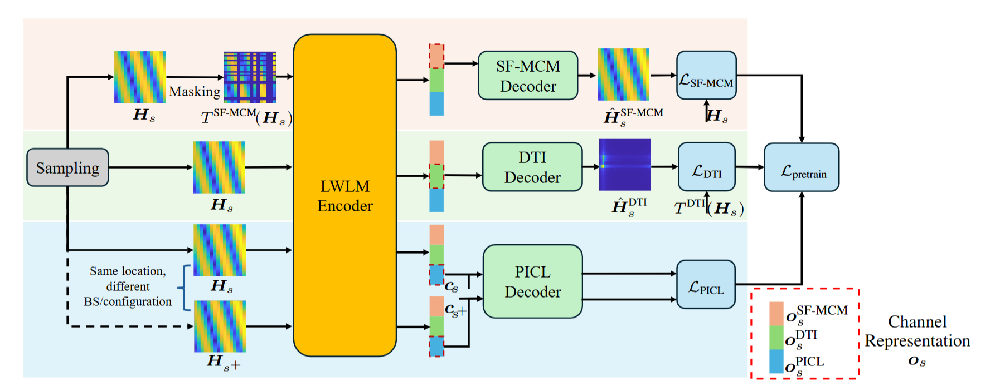

# LWLM: Large Wireless Localization Model

This repository contains the implementation of the paper:  **"Large Wireless Localization Model (LWLM): A Foundation Model for Positioning in 6G Networks."**  

If you have any questions or suggestions, feel free to contact me at **guangjin.pan@chalmers.se**.Thank you very much for your feedback, it can effectively motivate me and help improve this project.


## 🏋️‍♂️ Contributions
**Hybrid self-supervised learning framework for LWLM:** We propose a novel hybrid SSL pretraining framework for wireless localization tasks that jointly optimizes three objectives: (i) spatial-frequency masked channel modeling (SF-MCM) to capture local and global correlations across antennas and subcarriers, (ii) domain-transformation invariance (DTI) for enforcing consistency across spatial-frequency and angle-delay domains, and (iii) position-invariant contrastive learning (PICL) for capturing robust, location-dependent semantics invariant to BS configurations. While SF-MCM builds upon existing masked modeling techniques, DTI and PICL are newly introduced. This joint learning framework enables the model to acquire diverse, configuration-invariant, and location-aware representations from unlabeled CSI.

**Task-adaptive decoders for downstream localization tasks:** We develop lightweight task-specific decoders for key downstream localization tasks, including ToA estimation, AoA estimation, single-BS localization, and multi-BS fusion. To support an arbitrary number of BSs, the multi-BS decoder extends single-BS models with an attention-based fusion module that adaptively aggregates the location estimates of each BS.




## 🔧 How to Run

### 🏋️‍♂️ Pretraining

To pretrain the model, run:

```bash
python train.py \
  --task pretrain_mix \
  --model_path ../../pretrained_model/testmix \
  --is_frozen 0 \
  --is_load 0 \
  --depth 4 \
  --load_pretrained_mdl_path ../../pretrained_model/pretrain_mix/testepoch=139.ckpt


### 🎯 Fine-tuning

To fine-tune the pretrained model, run:

python train.py \
  --task SingleBSLoc \
  --model_path ../../pretrained_model/SingleBSLoc/mix/nofrozen/10000/test2 \
  --is_frozen 0 \
  --is_load 1 \
  --depth 4 \
  --load_pretrained_mdl_path ../../pretrained_model/pretrain_mix/testepoch=139.ckpt \
  --FT_dataset 10000 \
  --BW 10 \
  --pilot_subcarrier_interval 1 \
  --pilot_antenna_interval 1 \
  --BS_Num 4
```


##  Citation

If you find this work helpful, please consider citing:


